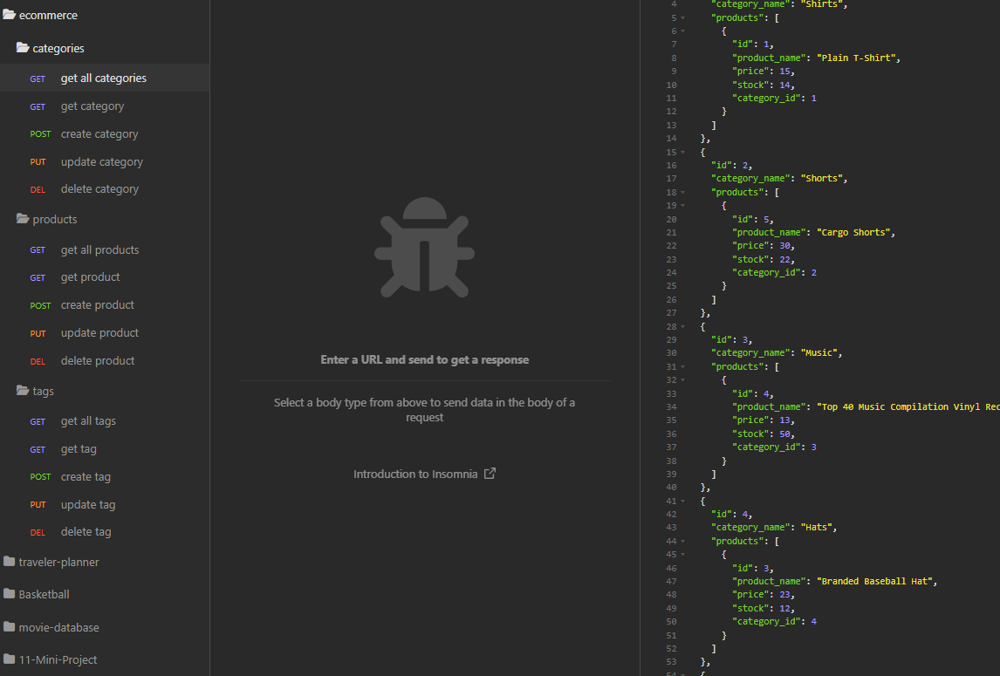

# e-commerce-back-end

## Description

- What was your motivation?
  - To build an e-commerce backend setup
- Why did you build this project?
  - To better familiarize myself with creating routes and working with databases
- What problem does it solve?
  - Gives CRUD functionality to database
- What did you learn?
  - How to effectively use Insomnia to test routes
  - How to build routes in Sequalize
  - how to build databases in Sequalize

## Installation

- Requires installing these npm packages: [MySQL2](https://www.npmjs.com/package/mysql2), [Sequelize](https://www.npmjs.com/package/sequelize) and [dotenv](https://www.npmjs.com/package/dotenv).

- Run MySQL and source the schema.sql file
- Seed data by inputing "npm run seed"
- Run server

## Usage

- Using the routes provided you can get all, get by id, create, update and delete categories, products and tags within the e-commerce database.

- Demo video https://drive.google.com/file/d/1cG7q2DvptO-XqkHAsTITFwP--1_8sAfn/view
- 

## Credits

- Tools used: Insomnia - to test routes

## License

N/A
